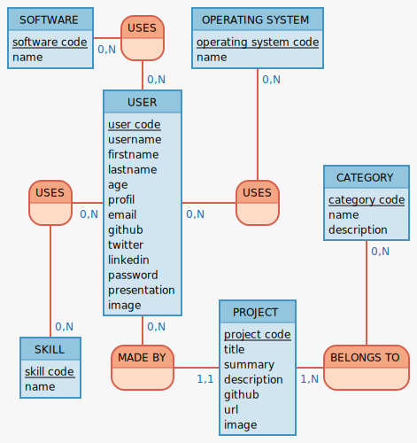

# portfolio-v2

## Voici la deuxième version de mon portfolio avec toujours le même template mais cette fois-ci avec le framework Symfony et une réelle base de données

## Schéma des données



## Modèle conceptuel de données

```
POST : post code, title, content
BELONGS TO1, 1N POST, 0N CATEGORY
SKILL : skill code, name
USES, 0N USER, 0N SKILL
SOFTWARE : software code, name

HAS2, 0N POST, 11 COMMENT
CATEGORY : category code, name, description
MADE BY, 11 PROJECT, 0N USER
USER : user code, firstname, lastname, age, profil, email, github, twitter, linkedin
USES3, 0N USER, 0N SOFTWARE

COMMENT : comment code, author, content
BELONGS TO, 1N PROJECT, 0N CATEGORY
PROJECT : project code, title, summary, description, github, demonstration
USES2, 0N USER, 0N OPERATING SYSTEM
OPERATING SYSTEM : operating system code, name
```

## Modèle logique de données

```
POST ( post code, title, content )
BELONGS TO ( post code, category code )
SKILL ( skill code, name )
USES ( user code, skill code )
SOFTWARE ( software code, name )
CATEGORY ( category code, name, description )
USER ( user code, firstname, lastname, age, profil, email, github, twitter, linkedin )
USES ( user code, software code )
COMMENT ( comment code, author, content, post code )
BELONGS TO ( project code, category code )
PROJECT ( project code, title, summary, description, github, demonstration, user code )
USES ( user code, operating system code )
OPERATING SYSTEM ( operating system code, name )
```
